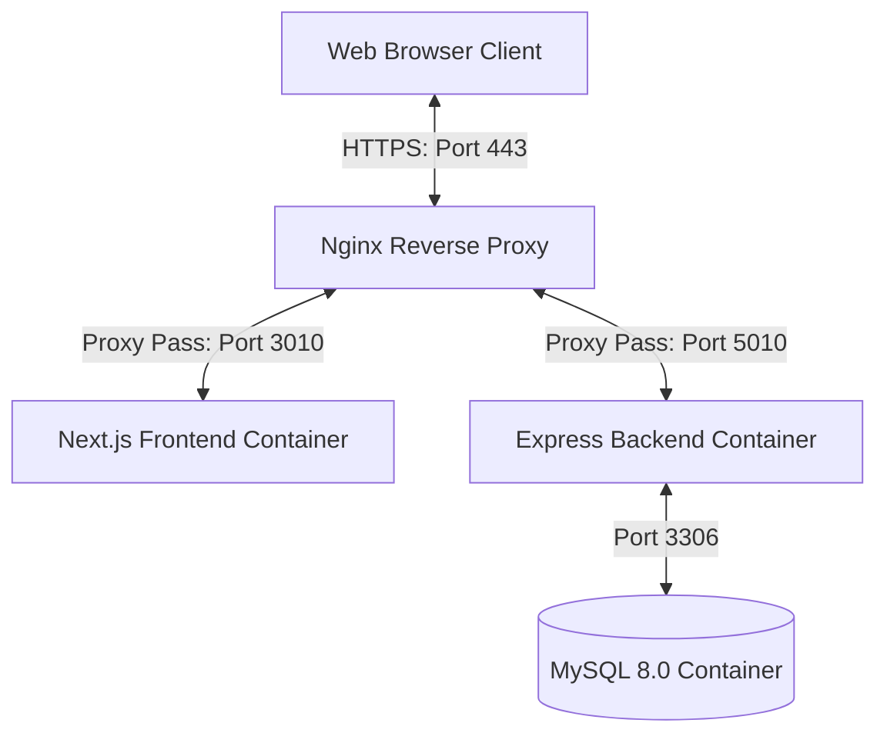

# 🚀 PANDUAN DEPLOYMENT PRODUCTION: DATAANALIS

Dokumen ini berisi panduan langkah-demi-langkah (step-by-step) lengkap untuk melakukan deployment aplikasi **DataAnalis** di server VPS (Ubuntu/Debian) Anda. Panduan ini mencakup konfigurasi sistem, setup basis data, reverse proxy Nginx, pengamanan SSL HTTPS, hingga otomatisasi pencadangan (backup).

---

## 📐 Arsitektur Deployment

Aplikasi berjalan di dalam lingkungan terisolasi menggunakan **Docker Compose** dengan susunan sebagai berikut:



*   **Frontend**: Next.js (Port internal: `3000`, Port VPS: `3010`)
*   **Backend**: Node.js + Express + Prisma (Port internal: `5000`, Port VPS: `5010`)
*   **Database**: MySQL 8.0 (Port internal: `3306`, Port VPS: `3309`)
*   **Reverse Proxy**: Nginx (Port default: `80` & `443` HTTPS dengan SSL Certbot Let's Encrypt)

---

## 📋 1. Persiapan VPS (System Requirements & Dependencies)

### Persyaratan Minimum Hardware:
*   **Sistem Operasi**: Ubuntu 20.04 LTS / 22.04 LTS / 24.04 LTS atau Debian 11/12
*   **CPU**: Minimal 1 Core (Rekomendasi 2 Core atau lebih untuk build Next.js)
*   **RAM**: Minimal 2 GB (Rekomendasi 4 GB). *Jika RAM VPS hanya 2 GB, sangat disarankan untuk mengaktifkan Swap Space minimal 2 GB agar proses build tidak error akibat Out-Of-Memory (OOM).*
*   **Disk**: Minimal 10-15 GB SSD kosong.

### Mengaktifkan Swap Space (Opsional - Sangat Direkomendasikan jika RAM ≤ 2GB):
```bash
sudo fallocate -l 2G /swapfile
sudo chmod 600 /swapfile
sudo mkswap /swapfile
sudo swapon /swapfile
echo '/swapfile none swap sw 0 0' | sudo tee -a /etc/fstab
```

### Instalasi Dependensi Utama:
Jalankan perintah ini di VPS Anda untuk menginstal Docker Engine, Docker Compose, Nginx, Git, openssl, dan Certbot:

```bash
# 1. Update package lists & upgrade sistem
sudo apt update && sudo apt upgrade -y

# 2. Instalasi package utilitas pendukung
sudo apt install apt-transport-https ca-certificates curl software-properties-common git openssl -y

# 3. Tambahkan Docker official GPG key & repository
curl -fsSL https://download.docker.com/linux/ubuntu/gpg | sudo gpg --dearmor -o /usr/share/keyrings/docker-archive-keyring.gpg
echo "deb [arch=$(dpkg --print-architecture) signed-by=/usr/share/keyrings/docker-archive-keyring.gpg] https://download.docker.com/linux/ubuntu $(lsb_release -cs) stable" | sudo tee /etc/apt/sources.list.d/docker.list > /dev/null

# 4. Install Docker Engine dan CLI
sudo apt update
sudo apt install docker-ce docker-ce-cli containerd.io -y

# 5. Install Docker Compose plugin (versi v2 terbaru)
sudo apt install docker-compose-plugin -y

# 6. Install Nginx dan Certbot
sudo apt install nginx certbot python3-certbot-nginx -y
```

Pastikan Docker & Nginx berjalan otomatis saat booting:
```bash
sudo systemctl enable --now docker
sudo systemctl enable --now nginx
```

---

## 📂 2. Clone Repository & Setup Struktur Direktori

1. Buat direktori aplikasi dan clone repository Anda ke dalamnya:
   ```bash
   sudo mkdir -p /var/www/dataanalis
   sudo chown -R $USER:$USER /var/www/dataanalis
   git clone https://github.com/lutfllhm/iwareanalis.git /var/www/dataanalis
   cd /var/www/dataanalis
   ```

2. Buat folder untuk menampung log backend agar persisten:
   ```bash
   mkdir -p backend/logs
   ```

---

## 🔐 3. Konfigurasi Environment Variables (`.env`)

Salin file `.env.production` ke `.env`:
```bash
cp .env.production .env
```

Buka file `.env` menggunakan teks editor:
```bash
nano .env
```

> [!IMPORTANT]
> Konfigurasikan seluruh variabel di bawah ini dengan benar untuk memastikan keamanan sistem Anda di production.

| Variabel Environment | Deskripsi / Penjelasan | Cara Mengisi / Rekomendasi |
| :--- | :--- | :--- |
| **`DB_NAME`** | Nama database MySQL di dalam kontainer. | Biarkan default: `dataanalis` |
| **`DB_USER`** | Username untuk akses database MySQL. | Gunakan username kustom (contoh: `dataanalis_admin`) |
| **`DB_PASSWORD`** | Password untuk user database di atas. | **Wajib diubah** dengan string password yang panjang dan kuat. |
| **`DB_ROOT_PASSWORD`** | Password root untuk server MySQL. | **Wajib diubah** dengan string password yang sangat kuat. |
| **`PORT`** | Port internal tempat API backend berjalan. | Biarkan default: `5010` (dipetakan ke port `5000` internal kontainer) |
| **`NODE_ENV`** | Mode jalannya server NodeJS. | Selalu isi: `production` |
| **`JWT_ACCESS_SECRET`** | Kunci rahasia enkripsi Access Token JWT. | Buat string acak (min 32 karakter). |
| **`JWT_REFRESH_SECRET`** | Kunci rahasia enkripsi Refresh Token JWT. | Buat string acak (min 32 karakter). |
| **`ENCRYPTION_KEY`** | Kunci enkripsi AES untuk token Accurate. | **Wajib diisi 64 karakter Hex (32 bytes)**. Lihat cara generate di bawah. |
| **`ACCURATE_MOCK`** | Flag untuk memicu mock data / API real. | Set ke `false` untuk production. |
| **`ACCURATE_CLIENT_ID`** | Client ID Aplikasi Accurate Anda. | Dapatkan dari panel Accurate Developer. |
| **`ACCURATE_CLIENT_SECRET`**| Client Secret Aplikasi Accurate Anda. | Dapatkan dari panel Accurate Developer. |
| **`ACCURATE_REDIRECT_URI`** | URI callback setelah otentikasi OAuth2. | Harus berupa HTTPS (contoh: `https://analys.iware.tech/settings`) |
| **`NEXT_PUBLIC_API_URL`** | Endpoint API backend yang diakses frontend. | Harus mengarah ke HTTPS (contoh: `https://analys.iware.tech/api`) |

### Cara Generate Key Secara Aman via Terminal:
*   Untuk **`JWT_ACCESS_SECRET`** & **`JWT_REFRESH_SECRET`**:
    ```bash
    openssl rand -base64 32
    ```
*   Untuk **`ENCRYPTION_KEY`** (Harus berupa Hex 32-bytes / 64-karakter):
    ```bash
    openssl rand -hex 32
    ```

---

## 🌐 4. Konfigurasi Nginx & SSL HTTPS (Certbot)

Aplikasi Next.js (`port 3010`) dan Express API (`port 5010`) akan di-proxy oleh Nginx pada port standard `80` (HTTP) dan `443` (HTTPS).

1. Salin konfigurasi Nginx bawaan dari project ke direktori Nginx:
   ```bash
   sudo cp nginx.conf /etc/nginx/sites-available/dataanalis
   ```

2. Aktifkan konfigurasi dengan membuat symlink ke folder `sites-enabled`:
   ```bash
   sudo ln -s /etc/nginx/sites-available/dataanalis /etc/nginx/sites-enabled/
   ```

3. Hapus konfigurasi default Nginx agar tidak bentrok dengan domain baru:
   ```bash
   sudo rm -f /etc/nginx/sites-enabled/default
   ```

4. **Buat Sertifikat SSL Dummy (Self-Signed) Sementara**:
   Karena file `nginx.conf` sudah merujuk ke jalur SSL Let's Encrypt (`/etc/letsencrypt/live/analys.iware.tech/...`), Nginx akan memicu error **BIO_new_file() failed** jika berkas tersebut belum ada. Kita buat sertifikat dummy sementara agar Nginx bisa menyala:
   ```bash
   # 1. Buat folder sertifikat (ganti dengan domain Anda jika berbeda)
   sudo mkdir -p /etc/letsencrypt/live/analys.iware.tech

   # 2. Buat sertifikat dummy self-signed
   sudo openssl req -x509 -nodes -days 365 -newkey rsa:2048 \
     -keyout /etc/letsencrypt/live/analys.iware.tech/privkey.pem \
     -out /etc/letsencrypt/live/analys.iware.tech/fullchain.pem \
     -subj "/CN=analys.iware.tech"
   ```

5. Buka file konfigurasi tersebut untuk memverifikasi domain:
   ```bash
   sudo nano /etc/nginx/sites-available/dataanalis
   ```
   *Pastikan nilai variabel `server_name` sudah diubah ke domain Anda (misal: `analys.iware.tech`).*

6. Uji konfigurasi Nginx untuk memastikan tidak ada error syntax:
   ```bash
   sudo nginx -t
   ```
   *(Sekarang pengetesan ini seharusnya berhasil karena file sertifikat dummy sudah ada)*

7. Restart layanan Nginx:
   ```bash
   sudo systemctl restart nginx
   ```

8. **Instalasi Sertifikat SSL Resmi (Let's Encrypt)**:
   Jalankan Certbot untuk menimpa sertifikat dummy tadi dengan sertifikat resmi Let's Encrypt secara otomatis:
   ```bash
   sudo certbot --nginx -d analys.iware.tech --force-renewal
   ```
   *(Pilih opsi untuk mengalihkan/redirect HTTP ke HTTPS jika ditanyakan oleh Certbot)*


---

## 🐳 5. Build dan Jalankan Aplikasi Menggunakan Docker Compose

Sebelum mulai, pastikan tidak ada port conflict pada port `3010`, `5010`, dan `3309` di VPS Anda.

1. Lakukan build image dan jalankan kontainer dalam mode daemon (background):
   ```bash
   docker compose --env-file .env up -d --build
   ```

2. Periksa status kontainer yang sedang berjalan:
   ```bash
   docker compose ps
   ```
   Pastikan ketiga kontainer (`dataanalis-mysql`, `dataanalis-api`, dan `dataanalis-web`) bertuliskan status **Up** atau **running**.

---

## 🗄️ 6. Inisialisasi & Seeding Database

Saat kontainer database (`dataanalis-mysql`) pertama kali dihidupkan, Docker akan otomatis mengeksekusi semua berkas `.sql` yang ada di dalam folder `./database` yang dimounting ke folder `/docker-entrypoint-initdb.d/`.

*   `01-schema.sql` akan membuat seluruh tabel yang dibutuhkan.
*   Script sql tersebut secara bawaan juga sudah melakukan seed satu user Admin utama:
    *   **Email**: `admin@iware.id`
    *   **Password**: `jasad666`

### Seeding Data Transaksi Mock (Opsional):
Jika Anda ingin mengisi database dengan data dummy/mock transaksi lengkap (pelanggan, barang jasa, faktur, retur penjualan) untuk keperluan uji coba di awal:
```bash
docker compose exec dataanalis-backend npm run seed
```

---

## 👮 7. Pengamanan Server (Security Hardening)

Secara bawaan, Docker Compose memetakan port internal kontainer ke luar VPS. Agar database MySQL tidak terekspos secara publik, lakukan langkah keamanan berikut:

### Batasi Port Database di Docker Compose:
Buka berkas `docker-compose.yml` Anda:
```bash
nano docker-compose.yml
```
Cari bagian konfigurasi port untuk `dataanalis-db` (MySQL) dan ubah dari `"3309:3306"` menjadi `"127.0.0.1:3309:3306"`.
```yaml
    ports:
      - "127.0.0.1:3309:3306"
```
> [!WARNING]
> Dengan mengubah ke `127.0.0.1:3309:3306`, database MySQL Anda hanya dapat diakses dari dalam server lokal VPS itu sendiri (Localhost). Hal ini mencegah hacker melakukan brute force database secara langsung dari internet.

Setelah mengubah konfigurasi ini, terapkan ulang dengan perintah:
```bash
docker compose up -d
```

### Konfigurasi Firewall (UFW):
Aktifkan firewall di VPS Anda dan ijinkan akses hanya untuk port HTTP, HTTPS, dan SSH:
```bash
sudo ufw default deny incoming
sudo ufw default allow outgoing
sudo ufw allow 22/tcp
sudo ufw allow 80/tcp
sudo ufw allow 443/tcp
sudo ufw enable
```

---

## 💾 8. Backup & Restore Database Secara Otomatis (Cron Job)

Untuk menjaga keamanan data Anda dari kerusakan, buat skrip backup harian otomatis menggunakan Cron Job.

1. Buat berkas skrip backup:
   ```bash
   sudo nano /usr/local/bin/backup-dataanalis.sh
   ```

2. Masukkan kode skrip berikut (sesuaikan nama database & lokasi backup):
   ```bash
   #!/bin/bash
   BACKUP_DIR="/var/backups/dataanalis"
   DATE=$(date +%Y-%m-%d_%H%M%S)
   mkdir -p $BACKUP_DIR
   
   # Load environment variables dari file .env
   export $(grep -v '^#' /var/www/dataanalis/.env | xargs)
   
   # Jalankan mysqldump
   docker exec dataanalis-mysql mysqldump -u $DB_USER -p$DB_PASSWORD $DB_NAME > $BACKUP_DIR/backup_$DATE.sql
   
   # Kompres file backup menjadi gzip
   gzip $BACKUP_DIR/backup_$DATE.sql
   
   # Hapus backup yang usianya lebih dari 14 hari agar disk tidak penuh
   find $BACKUP_DIR -type f -name "*.gz" -mtime +14 -delete
   ```

3. Berikan izin eksekusi pada skrip tersebut:
   ```bash
   sudo chmod +x /usr/local/bin/backup-dataanalis.sh
   ```

4. Daftarkan skrip ke dalam Cron Job sistem agar berjalan otomatis setiap hari pada pukul **02:00 AM**:
   ```bash
   sudo crontab -e
   ```
   Pilih editor (misal Nano), lalu tambahkan baris berikut di bagian paling bawah file:
   ```cron
   0 2 * * * /usr/local/bin/backup-dataanalis.sh >> /var/log/dataanalis-backup.log 2>&1
   ```

---

## 🔍 9. Pemantauan & Troubleshooting

### Melihat Log Real-Time:
Untuk melihat log dari seluruh kontainer secara real-time:
```bash
docker compose logs -f
```
Atau melihat log dari kontainer backend/API saja:
```bash
docker compose logs -f dataanalis-backend
```

### Masalah: Certbot Error NXDOMAIN (DNS problem: NXDOMAIN looking up A for...)
Error ini terjadi karena Let's Encrypt tidak bisa memverifikasi domain Anda karena domain tersebut belum diarahkan ke IP VPS Anda di DNS Manager (atau propagasi DNS belum selesai).
*   **Solusi:** 
    1. Masuk ke DNS Manager domain Anda (Cloudflare, registrar domain, dll).
    2. Tambahkan **A Record** baru dengan name `analys` dan targetkan ke IP Publik VPS Anda.
    3. Tunggu sekitar 5-15 menit agar DNS menyebar.
    4. Setelah DNS aktif, jalankan ulang: `sudo certbot --nginx -d analys.iware.tech --force-renewal`.
    5. Selama menunggu DNS aktif, Anda tetap bisa melanjutkan deployment Docker. Browser hanya akan menampilkan peringatan keamanan (karena menggunakan SSL Dummy), klik **Advanced** -> **Proceed to website** untuk melewatinya sementara.

### Masalah: Kontainer Tidak Mau Menyala (Exit Status 1)
Hal ini biasanya disebabkan oleh kesalahan konfigurasi `.env`. Jalankan perintah berikut untuk mengecek error yang terjadi di baris code Node.js:
```bash
docker logs dataanalis-api
```

### Masalah: Port Conflict (Port Already in Use)
Jika proses startup gagal karena port `3010` atau `5010` sudah terpakai di server VPS oleh service lain, cari PID program tersebut dan matikan:
```bash
sudo lsof -i :3010
# matikan proses menggunakan PID yang ditemukan
sudo kill -9 <PID>
```
Atau ubah port eksternal di dalam `docker-compose.yml` pada bagian pemetaan port frontend/backend ke port lain yang kosong di VPS.

### Masalah: Kehabisan Memori Saat Build
Build frontend Next.js membutuhkan memori RAM yang cukup besar. Jika build macet atau berhenti di tengah jalan, pastikan Swap Space telah dikonfigurasi dengan benar (Langkah 1). Anda juga bisa melakukan restart engine docker:
```bash
sudo systemctl restart docker
```

---

## 🔄 10. Cara Update Aplikasi Ke Versi Terbaru

Jika di kemudian hari terdapat perubahan kode program di repository Git lokal/remote Anda, lakukan update dengan cara berikut:

```bash
cd /var/www/dataanalis

# 1. Tarik perubahan terbaru dari GitHub
git pull origin main

# 2. Re-build dan jalankan kontainer baru secara clean
docker compose down
docker compose --env-file .env up -d --build

# 3. Bersihkan Docker image lama yang tidak terpakai agar disk tidak penuh
docker image prune -f
```
